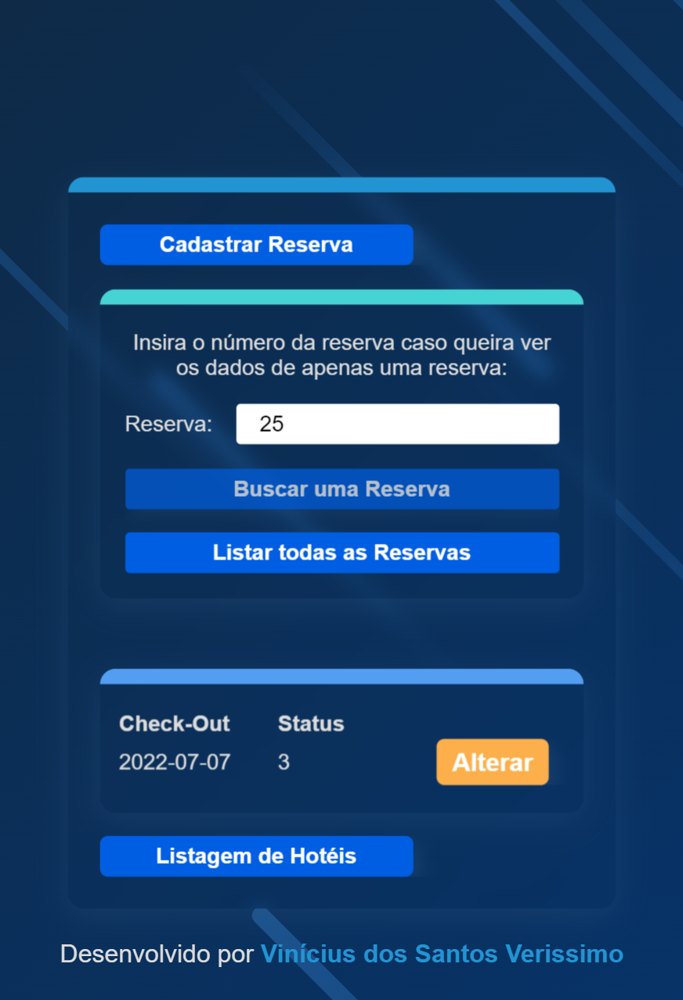

# Front-End para consumo da API de gerenciamento de reservas e hotéis

### Screenshot

### Screenshot - Mobile Version

  

### Construído com

-   React
-   Vite
-   JavaScript
-   TypeScript
-   Axios
-   Styled-Components
-   React Hook Form
-   Yup
-   Sweet Alert

A aplicação foi construída utilizando ReactJS com Typescript, por meio do Vite, com a
utilização do framework Styled-Components para estilização.

Utilizei a biblioteca React Hook Form em conjunto com a Yup a fim de facilitar o controle
das informações a serem preenchidas pelo usuário nos inputs do formulário e exibir
mensagens de erro para cada input.

Inicialmente é exibida uma tela com a listagem de hotéis cadastrados, onde é possível
solicitar a listagem completa ou os dados de um hotel específico a partir de seu CNPJ,
sendo exibida uma mensagem de não localizado caso não haja nenhum hotel cadastrado no
banco de dados com o CNPJ informado.

Ao clicar em "Listar todos os hotéis", é exibida a listagem de todos os hotéis
cadastrados, com um botão de "Alterar" que, ao ser clicado, redireciona o usuário para a
página de alteração, com os inputs já preenchidos com os dados atuais do hotel.

Caso queira criar um novo hotel, na página de listagem é possível clicar no botão
"Cadastrar Hotel", o qual redireciona para a página de criação com os inputs vazios a
serem preenchidos.

Se tentar cadastrar o hotel com algum campo em branco é emitida uma mensagem de alerta
para que seja preenchido, pois os campos são obrigatórios.

Também é possível acessar a listagem de reservas já cadastradas clicando no botão inferior
"Listagem de Reservas", onde também é possível listar todas as reservas ou apenas uma
específica a partir de seu número de reserva, que é único.

Em caso de exibição de uma reserva única, são exibidos dois botões, um amarelo para
alteração, e um vermelho, de nome "Ver Hóspedes", que abre um Modal com a listagem dos
hóspedes vinculados a esta reserva.

Ao se clicar no botão amarelo "Alterar", é redirecionado para a tela de atualização de
reserva, com os campos já preenchidos com os dados atuais da reserva.

Para criar uma reserva nova, é preciso clicar no botão "Cadastrar Reserva", presente no
canto superior esquerdo da tela de listagem de reservas, quando é redirecionado para a
tela de cadastro de nova reserva, com os campos em branco para serem preenchidos, sendo
igualmente exibidas mensagens de orientação caso tente cadastrar com algum campo vazio.

### Como utilizar

Para executar localmente, será preciso clonar o repositório e executar o comando 'npm
install' no terminal para instalar as dependências necessárias.

Após isso, é preciso executar 'npm run dev' no terminal para iniciar a aplicação,
consumindo a API cujo deploy foi feito em cloud via Heroku.

## Autor

-   GitHub - Vinícius dos Santos Verissimo (https://github.com/viniciusdsv93)
